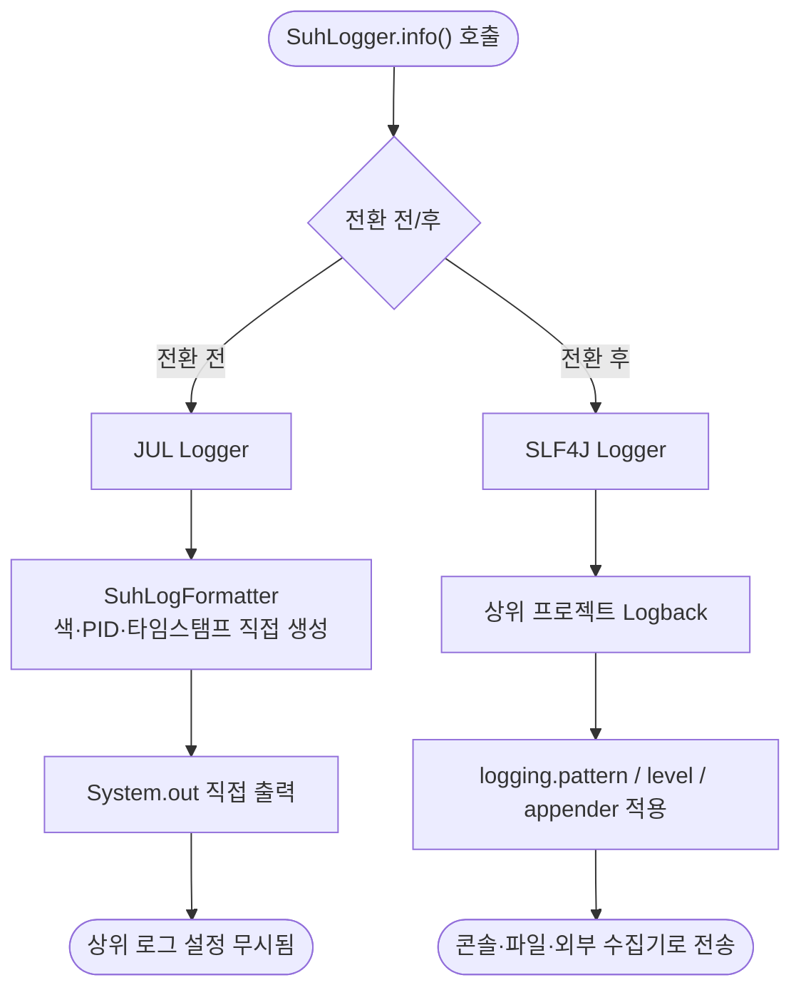

# 상위 프로젝트 SLF4J로 로그 출력 위임 전환

## 개요

suh-logger가 커스텀 `java.util.logging`(JUL) 기반으로 `System.out`에 직접 출력하던 방식을 걷어내고, **상위 스프링 프로젝트의 SLF4J 파이프라인으로 위임**하도록 전환했다. 기존에는 `NoOpLoggingSystemFactory`가 스프링부트의 Logback 초기화를 차단해, 상위 프로젝트의 `@Slf4j` 로그가 외부 수집기로 전송되지 않고 로그 패턴/레벨/Appender 컨벤션도 따르지 못하는 문제가 있었다. 이번 전환으로 suh-logger 출력이 상위 프로젝트의 `logging.pattern.*`·`logging.level.*`·logback appender를 그대로 따르며, 상위 `@Slf4j` 로그와 동일한 파이프라인을 공유한다. 공개 API 시그니처는 100% 유지되어 상위 프로젝트는 버전만 올리면 된다.

## 기능 흐름

전환 전후로 로그가 흐르는 경로가 근본적으로 바뀐다.

## 변경 사항

### 삭제 (커스텀 로깅 인프라)
- `config/NoOpLoggingSystemFactory.java`: 상위 Logback 초기화를 막던 근본 원인. 삭제하여 상위 로깅 시스템 정상화.
- `config/SuhLoggerConfig.java`: 커스텀 JUL 로거 + ANSI 포맷터 + `System.out` 직접 출력 핸들러. 상위 패턴이 대체하므로 삭제.
- `META-INF/spring.factories`: `LoggingSystemFactory` 등록 라인 제거 (`EnableAutoConfiguration`은 유지).

### 전환 (SLF4J 위임)
- `util/SuhLogger.java`: 내부 구현을 JUL → SLF4J로 교체. 정적 로거는 고정 이름(`kr.suhsaechan.suhlogger.util.SuhLogger`), 인스턴스 로거는 `getLogger(clazz)` 기반. 공개 메서드 시그니처는 전부 유지.
- `config/SuhLoggerAutoConfiguration.java`: `SuhLoggerInitializer`에서 SLF4J 차단 잔재(`System.setProperty` 등)와 JUL 참조 제거. 마스킹 설정 주입(`setProperties`)만 유지.
- `build.gradle`: 로깅 의존성 exclude 블록 전체 제거, `slf4j-api` compileOnly 추가. 테스트에서도 logback이 실제 바인딩되도록 exclude 해제.

### 하위호환 처리
- `setLogLevel(...)` / `addFileLogger(...)`: `@Deprecated` no-op 처리. 시그니처는 유지하되 호출 시 "상위 프로젝트 logging 설정으로 제어하세요" 안내 로그만 출력.

### 문서 갱신
- `README.md`, `docs/api-reference.md`, `docs/troubleshooting.md`: JUL·독립 로깅 기반 서술을 SLF4J 위임 기준으로 갱신.

## 주요 구현 내용

- **고정 로거 이름 채택**: 정적 메서드는 호출자 클래스를 스택트레이스로 추적하지 않고 고정 이름으로 출력한다. AOP가 찍는 메서드명·파라미터·JSON은 이미 메시지 본문에 담기므로 정보 손실이 없고, 상위 프로젝트에서 `logging.level.kr.suhsaechan.suhlogger`로 레벨 제어가 가능하다.
- **`{N}` 플레이스홀더 정규화**: 내부 메시지가 써오던 JUL의 `{0}`·`{1}` 인덱스 플레이스홀더를 SLF4J `{}`로 위임 직전에 정규식 치환(`replaceAll("\\{\\d+\\}", "{}")`)한다. 이 과정에서 기존에 `{1}` 이상 인자가 로그에서 누락되던 버그(예외 메시지 유실)도 함께 수정됐다. 치환은 라이브러리 내부 리터럴 템플릿에만 적용되며, 사용자 데이터(JSON 등)에 포함된 `{0}` 문자열은 인자로 전달되므로 오치환되지 않는다.

## 검증

실제 소비자 스프링부트 웹 앱을 구성해 mavenLocal의 suh-logger를 `exclude` 없이 소비하고, 상위 프로젝트만의 커스텀 logback 패턴(`>>>[레벨] 로거 ::: 메시지<<<`)을 설정해 구동한 결과:

- suh-logger 출력이 상위 커스텀 패턴을 **그대로 따라감** 확인
- 상위 `@Slf4j` 로그와 suh-logger 로그가 동일 패턴·동일 appender 공유 확인
- 인스턴스 `{}` 위임, `timeLog`의 `{N}` 치환, deprecated no-op(파일 미생성) 정상 동작 확인
- `SLF4J: No providers` 경고 없음 (logback 정상 바인딩)

## 주의사항

- **로그 레벨·파일 출력 제어 위치 변경**: 기존 `SuhLogger.setLogLevel()` / `addFileLogger()`는 no-op가 됐다. 상위 프로젝트에서 `logging.level.kr.suhsaechan.suhlogger` 설정 및 logback appender로 대체해야 한다.
- **관찰 가능한 동작 변경**: 이번 배포로 suh-logger의 출력 형식이 상위 패턴을 따르도록 바뀌므로, patch가 아닌 마이너 버전 업으로 릴리스한다.
- **비-웹(non-servlet) 애플리케이션**: `SuhLoggingFilter`가 servlet API에 의존하므로, 웹이 아닌 앱에서는 자동설정이 필터 빈을 생성하며 클래스 미존재 이슈가 드러날 수 있다. 이는 이번 전환과 별개인 기존 구조이며, 대부분의 상위 프로젝트는 웹 앱이라 실사용엔 영향이 없다. 별도 개선 대상(`@ConditionalOnWebApplication`)으로 기록한다.
